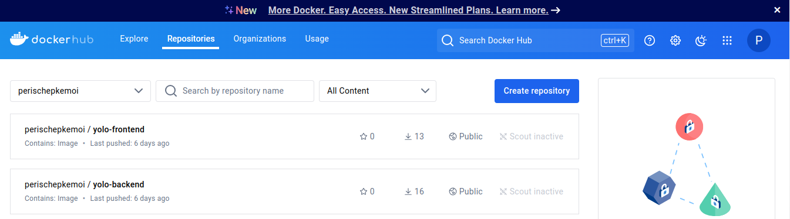

# Overview

This project involves the containerization and deployment of a full-stack YOLO e-commerce application using Docker. The application consists of three services:
- A **frontend** (built with React and served using NGINX)
- A **backend** (Node.js API)
- A **MongoDB** database

Docker is used to build and manage these services, while Docker Compose orchestrates and networks them together in a multi-container environment.

# Requirements

Ensure Docker is installed on your machine:

- [Docker](https://docs.docker.com/engine/install/)

# How to Launch the Application

1. **Clone the Repository:**
   ```bash
   git clone git@github.com:ChepkemoiPeris/yolo.git
   cd yolo

2. **Start the Application:**
    ```bash
   docker compose up 

This command will:

Pull the images for the frontend and backend from the repository.
Set up networking between the services.
Persist data in MongoDB using Docker volumes.

3. **Access the Application:** 
    - The frontend will be accessible at: http://localhost:80
    - The backend will be running at: http://localhost:5000
    - MongoDB will be running at: mongodb://localhost:27017

4. **Shutting Down the Application:** 
    ```bash
    docker compose down

# Screenshot of Deployed Docker Images

    
# Troubleshooting

1. **View Running Containers:**
    ```bash
   docker ps 

2. **View Container Logs:**
    ```bash
   docker logs <container_name> 
